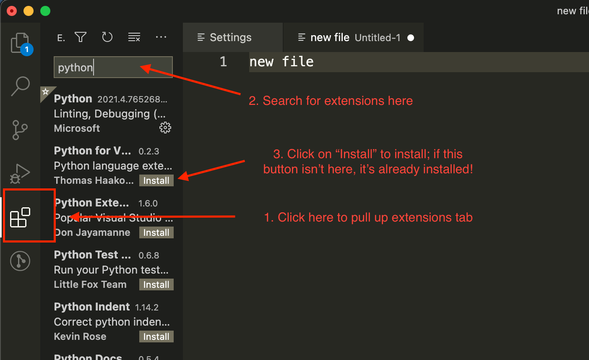
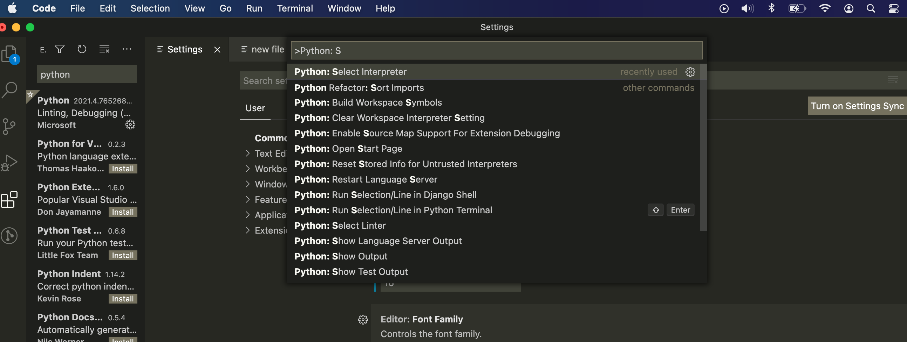
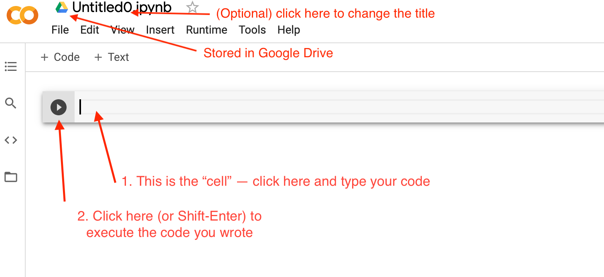
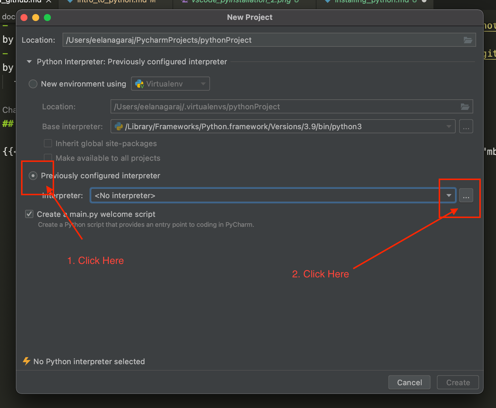
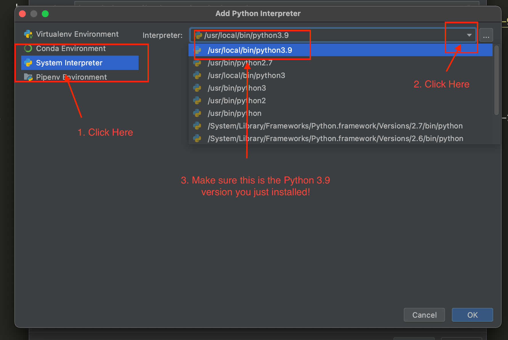

# 19 Oct - Introduction to Python / Installing Python


## Pre Requisites

- Review the course content from last class and bring any questions you have ! We will answer these questions at the beginning of class. (_Remember, if you have a question, so does someone else in the class, so please feel free to ask :)_ ) 
- Read through the `Python Installation Overview` section below. Spend some time thinking about which option may make sense for you. VSCode  will give you the most options and would enable you to continue practicing your command line and git/GitHub skills.
- Try getting set up with at least one of the options, but don't spend more than 1-2 hours on this if you run into a lot of unexpected problems. We will troubleshoot at the beginning of this session as well as in person at the ReDI school on Thursday for those who have issues installing.

## Class Curriculum

| Section content                                    | Expected time (mins) | Pre - Requirements                         |
| -------------------------------------------------- | -------------------- | ------------------------------------------ |
| Lesson Goals                                       | 5 minutes            | ❌                                         |
| Introduction to Python                             | 15-20 minutes        | Read and attempt installation instructions |
| Demo of each installation option                   | 20 minutes           | Read and attempt installation instructions |
| Break                                              | 10 minutes           | ❌                                         |
| Troubleshooting installation in groups             | 5-30 minutes         | Read and attempt installation instructions |
| Hands-on Python exercises (in small groups)        | rest of class        | ❌                                         |
| Check-out                                          | 5 minutes            | ❌                                         |

## 0. Lesson Goals

- Have a working development environment on Python.
- Build familiarity with the concepts of data types, functions, and control flow (loops, conditionals)
- Continue writing code in Python


## 1. Introduction to Python

### Q&A Intro

- What is Python?

  <!-- Python is an open-source, object-oriented, high-level, general purpose programming language. Since this definition may look overwhelming, let's take a look at each characteristic separately to understand what each of them means:

  Open-source: it's free and available for further improvements, like adding helpful features or fixing bugs
  Object-oriented: based not on functions but on objects with defined attributes and methods
  High-level: human-friendly rather than computer-friendly
  General purpose: can be used to create any kind of programs -->

- What is your motivation to learn Python?

- What are the advantages of Python?

 <!-- -
 - It has an intuitive syntax that resembles a natural English language and hence is easy to learn, especially for people who are just entering the world of programming
 - Because of its human-friendly syntax, it's easy to write, read, and debug
 - It provides an extensive standard library and a wide choice of well-documented and comprehensive additional libraries and modules
 - It's free both for individuals and businesses
 - Thanks to its huge supporting community, Python is constantly developed, improved, and expanded
 - It can be integrated into any project and used for solving advanced problems
 - Being a general-purpose language, it has various applications in many spheres
 -->


 <!-- -
 -->

  <!-- -
- What is a high-level programming language?

 "program": writing instructions for your computer to execute; this could be a simple "calculator" program that adds two numbers, it could be something that prints out values to your terminal or sends information to a remote server/web-page, etc.
  - "programming language": the language (set of words used according to specific syntax rules) that lets you write a program that can be executed on a machine
  - "high-level": there are different ways of interacting with the computer; at the lowest level, this is the binary code that computers can read and execute. Above that are different levels of closeness to machine-readable code: directly above is machine or _assembly_ code that is slightly more readable but also _compiles_ into this binary code for computers. There are more levels above this, and at the highest level (like Python), code words in human-readable languages (like English) represent large series of simple assembly steps. You can write some complex set of loops, etc. and the "Python interpreter" "interprets" these instructions in Python, turning them into something that the machine can comprehend. You don't have to worry about managing how your computer stores memory (more on this later), since Python takes care of this. -->

<!--
- What are terms that you may hear when discussing programs and programming languages?

  - "abstraction": something that has usually "hidden away" the inner complexities of a system; usually simplifies how we understand something.
  - "under the hood": the details of how something works when you look past the "layers of abstraction" (see above); digging into the numerous, smaller steps of how a program, application, etc. actually functions
  - "black box": a system whose inner-workings you do not understand; all you can see are the inputs and outputs. [ inputs -> BLACK_BOX -> outputs ] -->

- How and in what fields is Python typically used?

  <!-- 
  - Data Analysis: most companies are interested in gathering, manipulating, and analyzing relevant data to extract meaningful business insights from it. The most famous Python libraries for conducting data analysis are pandas and NumPy. These tools allow you to do almost everything with your data, such as cleaning and wrangling it, exploring statistics, or visualizing hidden trends in your data. Pandas: Python has many libraries (including `pandas`) that are useful for doing data analysis or statistics. Can be very efficient in how fast it computes data, and is for many people easier to read compared with other programming languages.

  - Data Visualization: Data visualization is a stand-alone part of data analysis that helps us represent the information, whether raw or cleaned and transformed, in a more compelling and insightful form. 
  Here Python comes again into play, offering a wide spectrum of tools for visualizing the data. The most popular of them are matplotlib and, based on it, seaborn. Using them, we can create literally all kinds of visualizations from simple ones (line plots, bar charts, histograms) to more advanced ones (animated plots, streamlines, cluster maps, joy plots, etc.).
  
  - Machine Learning, Deep Learning: Machine learning (ML) is at the core of the majority of data science tasks. Python ML libraries do most of the work under the hood, which significantly facilitates the user's task; to create neural networks and train machine learning models for prediction and generation tasks. The most common libraries are scikit-learn, Keras, TensorFlow, and PyTorch.

  - Web Development
  While for building the front end of a website (the part of a website accessible to its users), we would mostly use the languages such as HTML, CSS, and JavaScript, for its back end (the invisible part of a website), we would often opt for Python.  Applications created using Python; Google, Facebook, Instagram, YouTube, Dropbox, and Reddit.

  -Software Development
  Python is used at each stage of software development, including build control, automated continuous compilation, prototyping, bug tracking, testing, and software maintenance. 

  - Running systems and infrastructure: SREs (Site Reliability Engineers) often use python as a scripting language to quickly examine, configure, and maintain infrastructure systems. Compared with other languages, it takes little code/time to write and execute a function in Python. -->

- What examples of things you can do with Python?
<!--
  - Write programs of all kinds!
  - Write a backend server for your web application, to process (receive, send) HTTP requests
  - Use pandas to analyze a data set
  - Create and train a neural network or other machine learning/deep learning model
 -->

- What jobs need Python?

<!--
Many professions need Python directly for their everyday work. Below, we’ve outlined what you can do with Python in a professional capacity:

Data scientist
Data analyst
Data engineer
Machine learning engineer
Data journalist
Data architect
Full-stack web developer
Back-end web developer
DevOps engineer
Software engineer
-->


<!--  
- History of Python
- Python Ecosystem
- Core principles of Python code?
- What questions do you have so far?

-->


## 2. Python Tools


#### VSCode

Visual Studio Code, commonly referred to as VSCode, is a lightweight but powerful source code editor which runs on your desktop and is available for Windows, macOS and Linux. It comes with support for many languages including Python and has a rich ecosystem of useful extensions, e.g. for working with Git and Azure including a source control tab that will show your changes and handle a variety of git commands for you.. With VSCode we can take advantage of features like Intellisense code completion, linting, debug support, code snippets, and unit testing. Learn more about VS Code's Git support here:
https://code.visualstudio.com/docs/editor/versioncontrol#_git-support

**Documentation**: [https://code.visualstudio.com/docs](https://code.visualstudio.com/docs)


- can be used for writing and executing Python Notebooks (like in Colab) as well as pure Python scripts and modules (`.ipynb` and `.py` files)
- will require you to continue practicing your command line and git/GitHub skills
- recommended if you want to continue using the command line to navigate your file system and using git/GitHub as you develop your project, or you want to continue deepening your knowledge of one IDE rather than trying out a new platform


##### Open a WSL project in Visual Studio Code
<!--

- Download and install Python [at this link](https://www.python.org/downloads/) (latest version -- 3.10.0). Complete all of the installer steps.
- (Optional) in the installed Python folder, there should be an `IDLE` program. Double click or run this program, which opens a Python interactive shell. This will execute Python code statements. Try it out by printing something (hint: use the `print` function)
- In VSCode, install the following extensions by clicking on the extensions tab on the left, searching for the following extensions, and clicking "Install" (see diagram):

  - `Python`
  - `MagicPython`
  - `Visual Studio IntelliCode`
  - Another option: `Python Extension Pack` which includes all three of the above extensions plus a few more

  

- In VSCode in the `View` menu in the top left corner, click `Command Palette` (or use the shortcut `Command-Shift-P`) which should bring down a dropdown menu. Here, type `"Python: Select Interpreter"` and click on this option. This should bring up a list of all Python versions installed on your
  computer -- select `3.10.0`, the version you installed.
  
  --- -->
- If you already completed the steps on READ.ME file, Open your Linux distribution's command line via Windows Terminal and type ```code .``` (**Note:** it might take some time to install the VS Code Server if you run the command for the first time).

- You can also access more VS Code Remote options by using the shortcut: CTRL+SHIFT+P in VS Code to bring up the command palette. If you then type Remote-WSL you will see a list of the VS Code Remote options available, allowing you to reopen the folder in a remote session, specify which distribution you want to open in, and more.

- (Optional) test that this works! Create a new project or a new file with the `.py` ending (for example: `hello_world.py`). Have this file output `"Hello World!"` (hint: use the `print` function). Click on the green play button in the top right corner to run the code. This should open the terminal in VSCode and print out the output. If you run into errors, try restarting VSCode to make sure all changes were in place, and then if you run into the same issue, Google this error or ask a teacher or peer in class!

#### Jupyter Lab

JupyterLab is the latest open-source web-based interactive development environment for notebooks, code, and data. As such, it is one of the most popular tools for Data Scientists. Its flexible interface allows users to configure and arrange workflows in data science, scientific computing, computational journalism, and machine learning. A modular design invites extensions to expand and enrich functionality.

**Documentation**: [https://jupyterlab.readthedocs.io/en/stable/](https://jupyterlab.readthedocs.io/en/stable/)

##### Run JupyterLab 

- Activate the conda environment by opening your Linux distribution's command line via Windows Terminal and typing ```conda activate intro-to-cs```.
- Then type ```jupyter lab --no-browser``` to launch JupyterLab. Copy the URL, open the browser of your choice on your local workstation (e.g. Google Chrome), and paste the URL into the address bar. (**Note**: don't close the terminal as we have started an interactive JupyterLab session, which will be terminated once you close your terminal. You can stop the interactive session by pressing "CTRL + C".)
- You can now work with notebooks (".ipynb" format) in JupyterLab and follow the hands-on lab sessions during the rest of the data science bootcamp. All packages that you will need during the bootcamp are defined in the "environment.yml" file and have therefore been installed in your conda environment called "into-to-cs". Since we started the JupyterLab session from within this environment, you have now access to all required packages.

#### Google Colab

##### Overview

- free, requires a google account (gmail) and an internet connection
- no need to install Python on your computer, as Colab comes with an interpreter built-in that can run your code
- easy to create a new document or create a "copy" of assignments that we create
- can use the UI to save copies to GitHub or to your Google Drive
- makes it easy to execute and write code in notebook "cells"; it's possible to mix code and text in a readable and clear way
- notebook-style is very common in the Data Science space, so if you think you may want to go in the direction of data science or analytics, this could be a great option
  - here's an [example iPython Notebook](https://colab.research.google.com/github/tensorflow/examples/blob/master/courses/udacity_intro_to_tensorflow_for_deep_learning/l01c01_introduction_to_colab_and_python.ipynb?hl=en#scrollTo=OVi775ZJ2bsy) in Colab if you'd like to get a sense of what these are!
- can be used for writing Python Notebooks (`.ipynb` only, no pure `.py` files)
- one of the options used in the Intro to Python course with ReDI school
- recommended if you don't feel as comfortable installing Python on your machine or had difficulties with this, you don't want to work on the command line or use git/GitHub, or you are particularly interested in learning data science/analysis in the future

##### Setup instructions

- Visit [Google Colab](https://colab.research.google.com/). You may need to login with your gmail account or else create a Google Account in order to use Google Colab.
- In the bottom right, click on `New Notebook`. This will create a new Python Notebook in your Google Drive. Some notes:
  - You can rename this file by clicking on the name (probably `Untitled0`) in the top left and renaming this. (See diagram below).
  - (Note) If you want to save this Notebook in GitHub, you can create a repository in GitHub and initialize it with a `README` or other file. Then, in your Colab notebook, click `File > Save Copy to GitHub`. You may need to authorize your account (let GitHub know that it's ok for Colab to write to your repositories on your behalf), but then you can select this repository, and Colab will save a copy to it with the current state. If you make changes that you want to commit, you can repeat this process.
- In your notebook, click into the cell and write a Python statement of your choice (perhaps, a function to print `hello world` or add two numbers together). Then, click the play button (or use `Shift + Enter`) to execute this line of code. After a few seconds, the result of the expression should appear under the cell.
  
- Done! Optionally: check out the [Welcome to Colaboratory](https://colab.research.google.com/notebooks/intro.ipynb#) notebook that Google has provided, and watch the [short introductory video](https://www.youtube.com/watch?v=inN8seMm7UI) in it. This will just give you a sense of what you can do in Colab.


<!-- - #### PyCharm (Community Edition)

- Community Edition is free; upgrading to the Professional Edition is not necessary for the purposes of this course
- an IDE (integrated development environment) designed for Python
- requires you to have installed a version of Python on your machine
- built-in awesome features that help you write and execute Python code (function signature help + completion, syntax highlighting)
- can manage different Python virtual environments for you (different versions of Python, different additional packages specific to projects, etc.)
- can be used for writing and executing Python Notebooks (like in Colab) as well as pure Python scripts and modules (`.ipynb` and `.py` files)
- will require you to continue practicing your command line and git/GitHub skills
- one of the options used in the Intro to Python course with ReDI school
- recommended if you feel comfortable installing Python, want to continue using the command line to navigate your file system and using git/GitHub as you develop your project, or you think you may want to continue learning Python after this course

##### Setup Instructions

- Download and install Python [at this link](https://www.python.org/downloads/) (latest version -- 3.10.0). Complete all of the installer steps.
- (Optional) in the installed Python folder, there should be an `IDLE` program. Double click or run this program, which opens a Python interactive shell. This will execute Python code statements. Try it out by printing something (hint: use the `print` function)
- In PyCharm, can select different Python interpreters for each project. Since this is our first project, we need to add and setup a first interpreter. (In the future, you can select this interpreter again, or set up a new one in a similar way.)
- Open PyCharm and click on `New Project`. Choose a location for the new project; your normal coding folder is a good idea, as this will create a new directory within it.
- PyCharm will now ask you to configure your interpreter. Click on `Previously configured interpreter`, then on the three dots to the right of the select.
  
  _(Note) you can also use PyCharm to create Virtual Environments. This is a more advanced topic and is out of scope for today, but feel free to look into this and reach out if you would like to know more!_

- Select `System Installation` and select the path to your `Python 3.10` installation. Make sure that this is the path to the version of Python you just installed (3.10), **not any other version that was already installed on your computer**. (Note: the image shows the path to `3.9`, but it should say `3.10` for you if you downloaded the latest version of Python.)
  
- Click `Ok` to finish configuring the Python version
- PyCharm may have already created a test `main.py` file for you. (If not, go ahead and create a file like `hello_world.py` and have it print out `hello world` or something else!) Then press the green play button in the top right corner to run this code.

--- -->


### Short review of each installation option

- Colab, PyCharm, VSCode
- We will also take a look at a Python Notebook (`.ipynb`) vs. normal Python file `.py`. What is the difference between these two formats? How do we run each of these?
  - Notebooks are made up of "cells" which allow you to execute blocks of code. Cells can also contain Markdown or text, so these can be useful for demoing information or for storing plots, charts, and doing data analysis. Notebooks are commonly used in the Data Science and Machine Learning fields.
  - `.py` files are Python files, and can be executed by a Python interpreter via `path/to/python/installation filename.py` where you replace `path/to/python/installation` with the path to the location that you installed Python on your machine and `filename.py` with the name of your Python file. Your interpreter will also look for a `main.py` in your module or the statement: `if __name__ == '__main__':` in a file to know where to begin running your code. This is where you can tell the interpreter to start calling your functions.
- We will take a look at the `IDLE` Python terminal that comes with your Python installation and how you can interactively execute lines of code here. (There are other Python terminals that you can install or use, such as `ipython`.) This can be useful for testing out your logic and syntax as you are writing a longer program as well!


## 3. Troubleshooting in Groups

We will split up into groups based on whether folks have Python installed or are having issues so that we can troubleshoot and get everyone set up as quickly as possible :) We can also continue this during the in-person session if we can't solve these issues quickly enough!

Groups that are done with installation can start working on the Python problems from the following section.


## 4. First Python Script
### "Hello, World!" in Python

It's something of a tradition in the Computer Science world when learning a new language to write code that outputs "Hello, World!". Check out [this Wikipedia article](https://en.wikipedia.org/wiki/%22Hello,_World!%22_program) for more information on why :).


For today, go ahead and try that out in [this Python playground](https://trinket.io/python/f7ad7f9864), which will allow you to execute some test code by clicking on the Play button (triangle) on the top of the console window.


<!--
### write code that outputs "Hello, World!"


Tip: there is a built-in `print` function in Python that takes some input and outputs this to standard out (`STDOUT`), which is in this case the right side of the playground console.
(Recall that the `#` stands for a "comment" in Python, meaning that this line is just a "note" to yourself and does not need to be included.)

Example usage:

```python
print("Good evening!")
# outputs -> Good evening!
print("my name is", "Nesli")
# outputs -> my name is Nesli
```

```python
# This is my first Python script
# write code that outputs "Hello, World!"
# write code that outputs "My name is "your name""
```


<!-- A Solution:

```python
print("Hello, World!")
``` -->

### "Interactive Programming"

```python
print('Enter your name')
name = input()
print('Hello, ')
print(name)
```

```python
name = input('Enter your name\n')
age = int(input('Enter your age\n'))

print('Hello,', name,)
print('In 5 years you\'ll be', age + 5)
```


```python
```
--- -->

